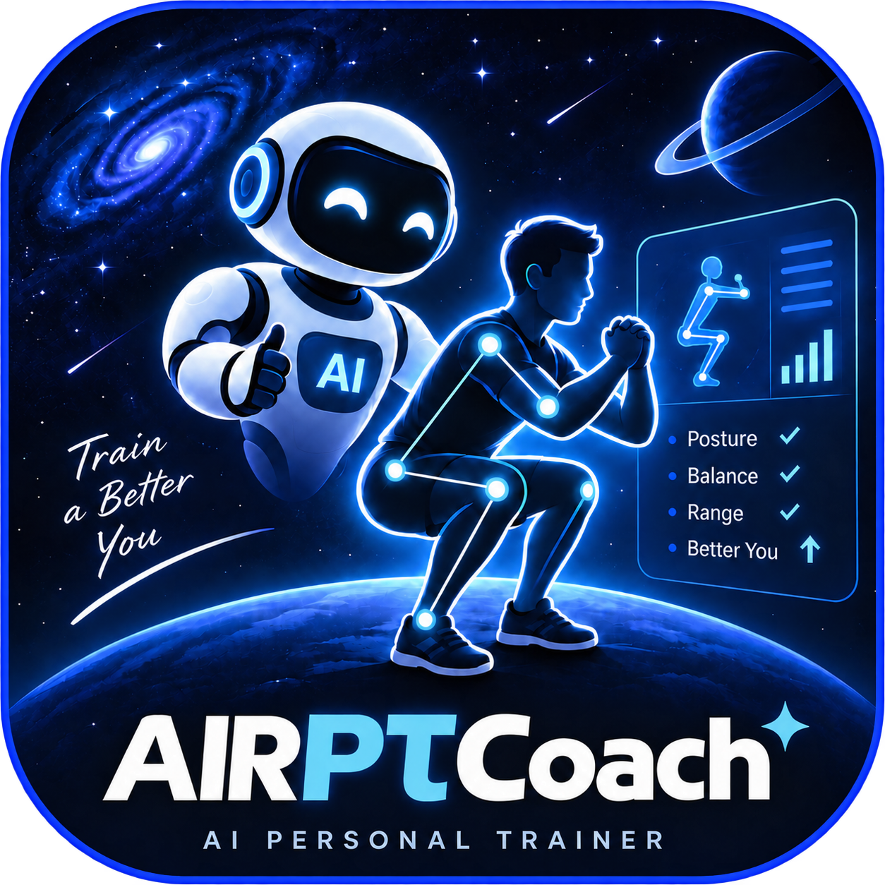
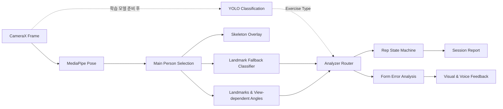

<div align="center">



# AIRPTCoach

### AI Personal Trainer · 실시간 운동 자세 분석 Android 앱

카메라 속 사용자를 추적하고, 관절 좌표와 운동별 분석 규칙을 이용해<br>
반복 횟수·자세 품질·교정 피드백을 제공하는 온디바이스 퍼스널 트레이너입니다.

[](https://developer.android.com/)
[](https://kotlinlang.org/)
[](https://ai.google.dev/edge/mediapipe/solutions/vision/pose_landmarker)
[](https://www.tensorflow.org/lite)
[](https://supabase.com/)
[](docs/DATASET_PIPELINE.md)

[핵심 기능](#-핵심-기능) · [아키텍처](#-ai-처리-아키텍처) · [생체역학 근거](#-생체역학-근거와-분석-원칙) · [시작하기](#-시작하기) · [데이터셋](#-dataset-pipeline) · [로드맵](#-로드맵)

</div>

---

## 프로젝트가 해결하려는 문제

혼자 운동할 때는 자신의 자세가 어떻게 보이는지, 어느 관절에서 동작이 무너지는지 확인하기 어렵습니다. AIRPTCoach는 스마트폰 카메라 한 대로 다음 질문에 답하는 것을 목표로 합니다.

- 앱이 지금 누구를 운동 주체로 추적하고 있는가?
- 사용자가 어떤 운동을 수행하고 있는가?
- 한 번의 동작이 정상 범위까지 수행됐는가?
- 무릎, 골반, 어깨, 팔꿈치 중 어디에서 자세 문제가 발생했는가?
- 운동이 끝난 뒤 어떤 기록과 피드백을 확인할 수 있는가?

## ✨ 핵심 기능

| 영역 | 기능 | 상태 |
|---|---|:---:|
| Pose Tracking | MediaPipe Pose Landmarker로 33개 관절의 `x/y/z/visibility` 추출 | ✅ |
| Visual Feedback | 추적 중인 사람의 관절점과 스켈레톤을 카메라 위에 표시 | ✅ |
| Person Selection | 검출된 포즈 중 가장 큰 관절 영역의 사용자를 우선 선택 | 🧪 |
| Exercise Analysis | 스쿼트·숄더프레스 관절 각도 추출 및 초기 운동별 분석 | 🧪 |
| Rep Counter | 관절 각도와 `UP/DOWN` 상태 머신을 이용한 반복 횟수 계산 | ✅ |
| Form Feedback | 무릎 모임과 상체 숙임 등 초기 자세 오류 규칙 분석 | 🧪 |
| Session Report | 횟수, 수행 시간, 평균 점수, 회차별 기록 생성 | ✅ |
| Authentication | Supabase 이메일 회원가입·로그인 | ✅ |
| Persistence | Room 로컬 기록 + Supabase 운동·신체·알림 설정 동기화 | ✅ |
| Calendar Reminder | 개인설정에서 Google 캘린더 반복 운동 일정 생성·관리 화면 연결 | ✅ |
| Exercise Classification | 학습된 YOLO Classification 모델 기반 자동 종목 인식 | 🚧 |
| Dataset Pipeline | repetition 단위 pose sequence·metadata·annotation 생성 | 🧪 |

> `✅ 구현됨` · `🧪 초기 구현/검증 필요` · `🚧 개발 예정 또는 진행 중`

## 🧠 AI 처리 아키텍처

AIRPTCoach에서 MediaPipe와 향후 학습할 운동 분류 모델은 서로 다른 책임을 가집니다.

- **Landmark Fallback Classifier**는 현재 MediaPipe 관절 배치를 이용해 운동 종목을 임시 추정합니다.
- **YOLO Classification**은 전용 데이터로 학습·검증한 모델이 준비된 뒤 운동 종목 판단을 담당할 예정입니다.
- **MediaPipe Pose**는 운동 중인 사람과 33개 관절 좌표를 지속적으로 추적합니다.
- **Exercise Analyzer**는 인식된 운동에 맞는 관절과 임계값을 선택합니다.
- **Overlay & Feedback**은 사용자가 추적 대상과 자세 문제를 즉시 이해하도록 시각화합니다.



### 현재 모델 상태

저장소의 `yolo11n-pose_int8.tflite`는 운동 종류를 분류하도록 학습·검증된 Classification 모델이 아닙니다. 따라서 현재 앱은 **MediaPipe 관절 추적이 YOLO 결과 때문에 중단되지 않도록 독립적으로 실행**합니다.

최종 목표는 학습 완료된 `READY / SQUAT / SHOULDER_PRESS` 분류 모델을 연결하여 아래 흐름을 완성하는 것입니다.

```text
운동 종목 인식 → 대상 사용자 관절 추적 → 운동별 관절 선택
→ 반복 구간 판정 → 오류 관절 식별 → 화면·음성 피드백
```

## 🧩 주요 분석 구성요소

| 구성요소 | 역할 |
|---|---|
| `DashboardActivity` | CameraX 프레임, MediaPipe 추론 및 실시간 UI 연결 |
| `OverlayView` | 관절점과 관절 연결선을 카메라 위에 렌더링 |
| `ExerciseClassifier` | 랜드마크 기반 임시 운동 분류 fallback |
| `PoseAngleExtractor` | 스쿼트·숄더프레스의 2D 내각 및 정규화 랜드마크 벡터각 계산 |
| `ExerciseCounter` | 운동별 임계값과 상태 전환으로 repetition 계산 |
| `FormErrorAnalyzer` | 관절 위치 관계를 이용한 자세 오류 후보 검출 |
| `CoordinateNormalizer` | 골반 중심 이동과 신체 크기 기반 좌표 정규화 |
| `DTWCalculator` | 사용자 동작 sequence와 표준 sequence 비교 |
| `AnalyzerFactory` | 운동 종류에 적합한 Analyzer 선택 |

## 📐 생체역학 근거와 분석 원칙

자세 분석은 단순히 관절 좌표 세 개로 각도를 계산하는 것에서 끝나지 않습니다. 같은 숫자라도 카메라 시점, 좌표계, 각도의 정의, 랜드마크 가시성에 따라 의미가 달라집니다. AIRPTCoach는 다음 원칙을 기준으로 분석 구조를 개선하고 있습니다.

- 이미지 2D 각도, 정규화 랜드마크 x/y/z 벡터각, 실제 world 좌표 기반 각도를 서로 다른 측정값으로 관리합니다.
- 무릎·팔꿈치의 **내각**과 논문에서 사용하는 **굴곡각**을 구분합니다. 같은 평면과 정의에서는 `굴곡각 = 180° - 내각`으로 변환할 수 있습니다.
- 정면에서는 좌우 대칭과 무릎의 전면 투영 정렬을, 측면에서는 깊이와 몸통·경골 기울기를 우선 분석합니다.
- 낮은 visibility, 관절 가림, 잘못된 촬영 시점은 정상으로 처리하지 않고 `NOT_EVALUABLE`로 구분할 예정입니다.
- 논문에 등장하는 집단 평균이나 실험 조건을 개인의 정상/오류 기준으로 바로 사용하지 않습니다.

수치 기준은 출처에 따라 `PAPER_DIRECT`, `PAPER_DERIVED`, `ENGINEERING_INITIAL`, `EXPERT_VERIFIED`로 구분합니다. 현재 반복 카운트와 초기 자세 규칙의 임계값은 모두 `ENGINEERING_INITIAL`이며, 의료적 정상/이상 판정 기준이 아닙니다.

저장소 분석, 각도 정의, 카메라 시점별 지원 범위, 논문별 적용 한계와 안전한 구현 순서는 [생체역학 근거 및 알고리즘 매핑](docs/BIOMECHANICS_REFERENCES.md)에 정리되어 있습니다.

### 참고한 핵심 연구

| 운동 | 연구 | 앱에 반영할 범위 |
|---|---|---|
| 스쿼트 | [Straub & Powers, 2024](https://doi.org/10.26603/001c.94600) | 깊이, 몸통·경골 기울기, 스탠스에 따른 생체역학적 차이 |
| 스쿼트 | [Escamilla, 2001](https://doi.org/10.1097/00005768-200101000-00020) | 굴곡 범위에 따른 무릎 부하 변화의 해석 경계 |
| 단일다리 스쿼트 | [Gwynne & Curran, 2014](https://pmc.ncbi.nlm.nih.gov/articles/PMC4275194/) | 전면 FPPA 정의와 2D 측정의 한계 |
| 스탠딩 오버헤드 프레스 | [An et al., 2025](https://doi.org/10.5103/KJAB.2025.35.2.76) | 상승·하강 단계별 어깨·팔꿈치·몸통 ROM 구성 |

## 🛠 기술 스택

### Android application

| 분류 | 기술 |
|---|---|
| Language | Kotlin 2.1.0 · Java 17 |
| UI | XML View · ViewBinding · Material Components |
| Camera | CameraX 1.3.1 |
| Pose estimation | MediaPipe Tasks Vision 0.10.14 |
| On-device inference | TensorFlow Lite 2.14.0 |
| Architecture | MVVM · ViewModel · StateFlow · Coroutines |
| Local data | Room 2.6.1 · KSP |
| Backend | Supabase Auth · PostgREST |
| Networking | Ktor Client Android |
| Charts | MPAndroidChart |

### Dataset & ML tooling

| 분류 | 기술 |
|---|---|
| Language | Python 3.10+ |
| Vision | MediaPipe · OpenCV |
| Data | NumPy · JSON · compressed NPZ |
| Design | dataclass · enum schema · strategy-based segmentation |
| Validation | dataset validator · `unittest` |

## 🗂 프로젝트 구조

```text
ArPtApp/
├── app/src/main/
│   ├── java/com/example/arptapp/
│   │   ├── data/                 # Room, Supabase, pose models
│   │   ├── domain/
│   │   │   ├── analyzer/         # 운동별 자세 분석
│   │   │   ├── classifier/       # 운동 종목 판단
│   │   │   └── counter/          # repetition state machine
│   │   ├── ui/feedback/          # 음성·진동 피드백
│   │   ├── utils/                # 좌표 정규화, TFLite, 알림
│   │   ├── DashboardActivity.kt  # 실시간 운동 분석 화면
│   │   └── OverlayView.kt        # 관절 구조 시각화
│   ├── assets/                    # MediaPipe/TFLite 모델과 표준 자세
│   └── res/                       # 네이비 기반 UI와 AIRPTCoach 로고
├── ai_module/
│   ├── pipeline/                 # pose·rep·annotation dataset builder
│   ├── training/                 # split·validation·향후 학습 entry point
│   ├── tests/                    # pipeline unit tests
│   └── dataset/                  # metadata·annotation·pose 구조
└── docs/
    ├── DATASET_PIPELINE.md        # 데이터셋 생성·검증 정책
    └── BIOMECHANICS_REFERENCES.md # 논문 근거·각도 정의·적용 한계
```

## 🚀 시작하기

### 요구사항

- Android Studio와 Android SDK
- JDK 17
- Android 8.0(API 26) 이상 기기 또는 Emulator
- 카메라 기능 사용 시 실제 Android 기기 권장

### 1. 저장소 받기

```bash
git clone https://github.com/WhiteBearCode02/ArPtApp.git
cd ArPtApp
```

GitHub 저장소 주소와 로컬 폴더명은 아직 `ArPtApp`입니다. Android 패키지명(`com.example.arptapp`), 기존 앱 데이터와 로그인 딥링크(`arptapp://auth/callback`)도 호환성을 위해 유지합니다. Gradle 프로젝트명과 사용자에게 보이는 앱 이름은 `AIRPTCoach`입니다.

### 2. Supabase 설정

프로젝트 루트의 `local.properties`에 다음 값을 추가합니다. 이 파일은 Git에 포함하지 않습니다.

```properties
sdk.dir=C\:\\Users\\YOUR_NAME\\AppData\\Local\\Android\\Sdk
supabase.url=https://YOUR_PROJECT.supabase.co
supabase.key=YOUR_SUPABASE_ANON_KEY
```

관리자 계정은 앱에 이메일을 하드코딩하지 않습니다. Supabase SQL Editor에서
[`supabase/admin-role-setup.sql`](supabase/admin-role-setup.sql)의 이메일 예시를 실제 관리자 계정으로 바꿔 실행한 뒤,
앱에서 로그아웃하고 다시 로그인하면 관리자 대시보드로 자동 이동합니다.

앱 회원가입 화면에서 이메일·비밀번호를 제출하면 Supabase Auth 계정이 생성됩니다. 이름과 선택 입력한 신체 수치는 가입 메타데이터를 거쳐 RLS로 보호된 `public.user_profiles`에 저장되며, 이후 변경 내용은 `body_measurements`에 이력으로 남습니다. 알림 시간은 기기 DataStore와 `user_preferences`에 함께 저장하고 실제 Android 알람은 각 기기에서 예약합니다. 운동 결과는 `exercise_sessions`와 `exercise_rep_records`에 계정별로 저장합니다. 비밀번호는 앱 DB에 별도로 저장하지 않습니다. 이메일 확인 기능이 활성화된 프로젝트라면 확인 메일의 링크를 연 뒤 로그인할 수 있고, 비활성화된 경우 가입 직후 앱으로 이동합니다.

개인설정의 Google 캘린더 항목은 Android Calendar Intent를 사용합니다. 앱이 캘린더 내용을 직접 읽거나 수정하지 않으며, 사용자가 Google 캘린더 화면에서 기존 일정을 수정하거나 미리 입력된 매일 반복 일정을 최종 저장합니다. 따라서 별도의 Google Calendar API 키와 캘린더 읽기·쓰기 권한이 필요하지 않습니다.

Google 로그인 사용 전에는 [Supabase Google 제공자 설정](https://supabase.com/docs/guides/auth/social-login/auth-google)에 따라 Google Cloud의 웹 OAuth 클라이언트 ID·Secret을 Supabase Auth → Providers → Google에 설정하고, Google의 승인된 리디렉션 URI에 Supabase 대시보드가 표시하는 callback URL을 추가해야 합니다. 또한 Supabase Auth → URL Configuration → Redirect URLs에 `arptapp://auth/callback`을 등록하세요. Google Client Secret은 Android 앱이나 `local.properties`에 넣지 않습니다. 이메일 인증 링크도 같은 앱 딥링크로 돌아옵니다.

### 3. 빌드

Windows PowerShell:

```powershell
.\gradlew.bat assembleDebug
```

macOS/Linux:

```bash
./gradlew assembleDebug
```

현재 프로젝트의 debug APK 출력 위치:

```text
build/app/outputs/apk/debug/app-debug.apk
```

> 과거 기본 경로인 `app/build/outputs/...`에 남은 APK는 오래된 파일일 수 있으므로 사용하지 마세요.

## 📦 Dataset Pipeline

학습 데이터는 목적에 따라 분리합니다.

| Dataset | 목적 | 초기 클래스/라벨 |
|---|---|---|
| Dataset A | YOLO 등 운동 종목 분류 | `READY`, `SQUAT`, `SHOULDER_PRESS` |
| Dataset B | pose sequence 기반 자세 오류 분석 | 스쿼트·숄더프레스 오류 label |

```mermaid
flowchart LR
    SOURCE[Source Metadata] --> VIDEO[Authorized Video]
    VIDEO --> MP[MediaPipe 33 Landmarks]
    MP --> NORM[Pose Normalization]
    NORM --> FEATURE[Joint Features]
    FEATURE --> REP[Rep Segmentation]
    REP --> AUTO[Pseudo Label]
    AUTO --> HUMAN[Human Verification]
    HUMAN --> DATASET[Versioned Dataset]
```



### 데이터셋 생성

```bash
python -m pip install -r ai_module/requirements.txt

python -m ai_module.pipeline.dataset_builder \
  --video ./data/test_squat.mp4 \
  --exercise SQUAT \
  --source-type LOCAL \
  --view SIDE \
  --subject-id person_001
```

### 검증과 subject-independent split

```bash
python -m ai_module.pipeline.dataset_validator --dataset-root ai_module/dataset
python -m ai_module.training.dataset_split --dataset-root ai_module/dataset --seed 42
python -m unittest discover -s ai_module/tests -v
```

스키마, annotation, repetition 구조 및 YouTube reference 정책은 [Dataset Pipeline 문서](docs/DATASET_PIPELINE.md)에 정리되어 있습니다.

> YouTube는 URL, video ID, timestamp 등 reference metadata만 저장합니다. 영상 자동·우회 다운로드 기능은 제공하지 않으며 학습에는 사용 권한이 명확한 영상만 사용해야 합니다.

## 🔐 권한 및 데이터 처리

앱은 카메라, 인터넷, 알림, 진동 관련 Android 권한을 사용합니다. Pose 추론과 기본 자세 분석은 기기에서 수행되며, 로그인과 운동 세션 업로드에는 사용자가 설정한 Supabase 프로젝트를 사용합니다.

실제 사용자 촬영 데이터를 학습 데이터로 사용할 때는 별도 동의, 비식별화, 보관 기간 및 삭제 정책을 마련해야 합니다.

## 🗺 로드맵

### Phase 1 · 안정적인 실시간 분석

- [x] CameraX 카메라 파이프라인
- [x] MediaPipe 33개 관절 추출
- [x] 대상 사용자 선택 및 스켈레톤 오버레이
- [x] 스쿼트·숄더프레스 각도 추출
- [x] repetition 상태 머신과 세션 리포트
- [x] Supabase 로그인, 운동 세션·횟수별 분석, 신체 이력 및 알림 설정 동기화
- [x] 현재 분석 흐름과 생체역학 근거·한계 문서화
- [ ] 각도 값·정의·좌표계·시점·품질을 포함하는 `AngleMeasurement` 도입
- [ ] 측정 불가 상태와 정상 상태 분리
- [ ] 중복 repetition counter 및 Analyzer 실행 경로 통합
- [ ] 오류 관절별 색상 강조와 상세 코칭 문구
- [ ] 실기기별 성능·발열·프레임 측정

### Phase 2 · 운동 자동 인식

- [x] TensorFlow Lite 추론 wrapper 기반
- [x] 랜드마크 기반 fallback classifier
- [ ] `READY / SQUAT / SHOULDER_PRESS` 데이터 수집
- [ ] YOLO Classification 학습·정량 평가
- [ ] 모델 metadata/label 검증 및 Android 연결
- [ ] 오인식 방지를 위한 temporal smoothing

### Phase 3 · 자세 품질 데이터셋

- [x] metadata 중심 schema v0.1.0
- [x] raw/normalized pose sequence 저장
- [x] 운동별 repetition segmentation strategy
- [x] rule 기반 pseudo label과 human label 분리
- [x] dataset validator와 subject-independent split
- [ ] 전문가 annotation 기준 확정
- [ ] 촬영 방향별 threshold 및 오류 규칙 검증
- [ ] 실제 데이터 기반 분류·자세 모델 학습

### 현재 검증 기준선

- Android debug 소스 컴파일 단계 통과
- Android 단위 테스트 12개 중 11개 통과
- 미해결 테스트: `SquatRepCounterTest.countsOnlyAfterStableDescentAndAscent`
  - 테스트 입력은 하강 자세로 95°를 사용하지만 구현 임계값은 90° 이하이므로 상태 전이가 발생하지 않음
  - 생체역학 기준과 카운트 정책을 확정하기 전 임계값이나 테스트 한쪽만 임의로 변경하지 않음
- Python 데이터셋 파이프라인 테스트는 별도 Python 3.10+ 환경에서 실행 필요

### Phase 4 · 제품 완성도

- [ ] 관절별 실시간 위험도 시각화
- [ ] 주간·월간 운동 분석 대시보드
- [ ] 사용자별 표준 동작 calibration
- [ ] 접근성 및 다양한 화면 크기 대응
- [ ] CI 기반 Android/Python 자동 테스트

## ⚠️ 현재 알려진 제한사항

- 포함된 YOLO pose 모델을 운동 Classification 모델처럼 사용해서는 안 됩니다.
- 자세 오류 규칙과 pseudo label 임계값은 초기값이며 전문가 검증이 필요합니다.
- 현재 `NormalizedLandmark`의 x/y/z로 계산한 벡터각은 실제 모션캡처 기반 3D 관절각과 동일하지 않습니다.
- 현재 일부 분석 경로는 측정 불가 상태를 `0.0` 또는 빈 오류 목록으로 처리하므로 품질 상태 분리가 필요합니다.
- 현재 다인 선택 정책은 가장 큰 바운딩 영역을 사용하지만 Pose Landmarker의 포즈 수와 프레임 간 사용자 지속 추적은 추가 검증이 필요합니다.
- Room의 명시되지 않은 버전 이동은 `fallbackToDestructiveMigration()` 때문에 기록 손실 가능성이 있어, 스키마 확장 전 명시적 마이그레이션이 필요합니다.
- 실제 정확도, FPS 및 CPU 절감률은 아직 표준화된 기기 벤치마크로 측정되지 않았습니다.
- Python 데이터셋 테스트는 Python 3.10 이상 환경에서 별도로 실행해야 합니다.
- 이 앱의 분석 결과는 운동 보조 정보이며 의료 진단을 대체하지 않습니다.

## 🤝 기여 방법

1. 이 저장소를 fork합니다.
2. 작업 브랜치를 만듭니다: `git switch -c feature/your-feature`
3. Android 빌드와 관련 테스트를 실행합니다.
4. 변경 목적, 검증 결과, UI 변경 시 스크린샷을 PR에 첨부합니다.

버그 제보 시 기기 모델, Android 버전, 재현 순서와 관련 Logcat을 함께 제공해 주세요.

---

<div align="center">

**Train a Better You.**

Built by [WhiteBearCode02](https://github.com/WhiteBearCode02)

</div>
